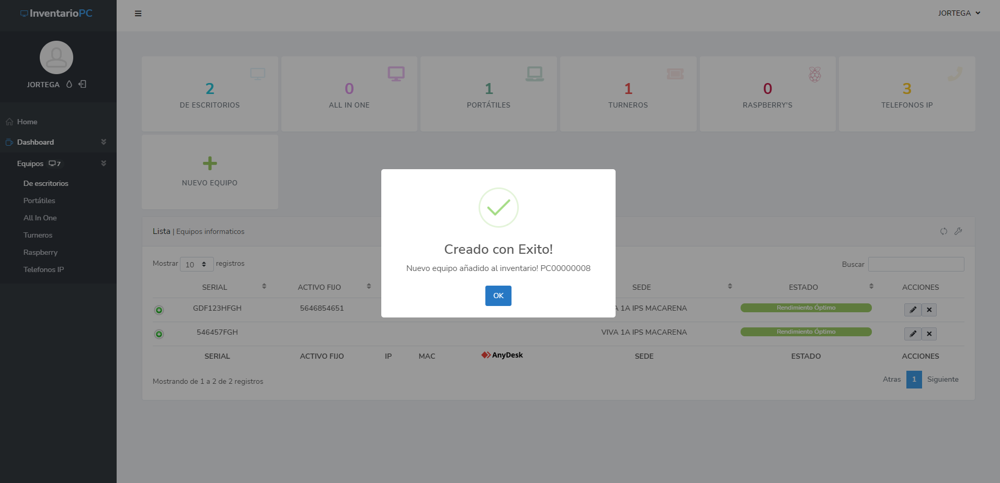

## InventarioPC

Plataforma web con PHP Laravel para registro y control de inventarios de equipos informáticos.

.jpeg)

Panel administrativo

.jpeg)

.jpeg)

.jpeg)

.jpeg)

Registro

.jpeg)

.jpeg)

## Paquetes utilizados

https://github.com/spatie

https://github.com/Maatwebsite/Laravel-Excel

https://github.com/yajra/laravel-datatables

## License

The Laravel framework is open-sourced software licensed under the [MIT license](https://opensource.org/licenses/MIT).
